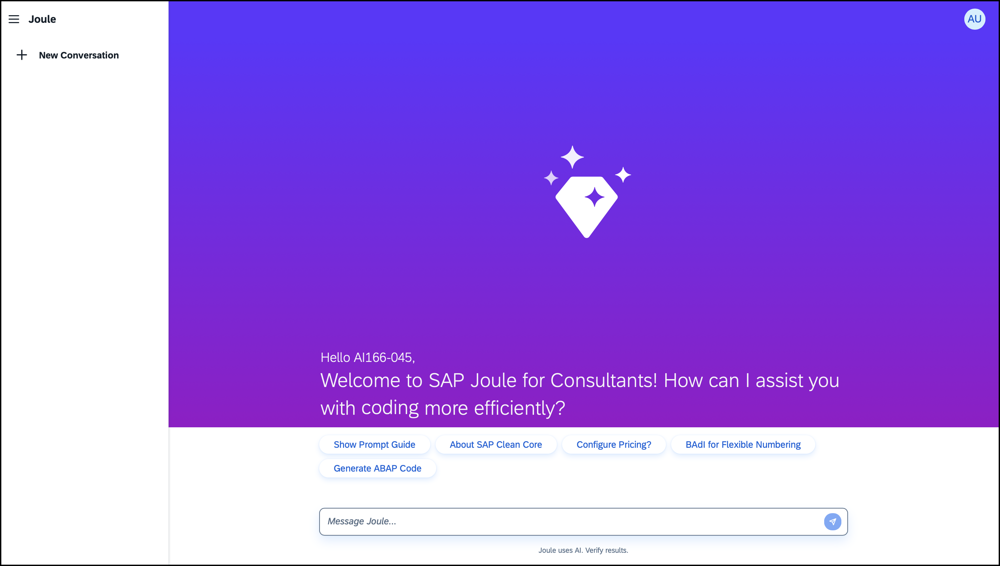
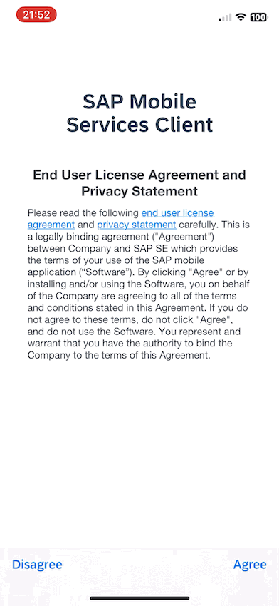
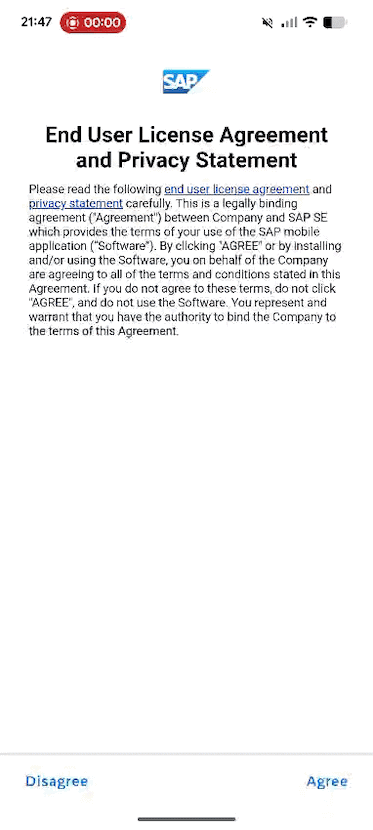

# Exercise 1 - Evaluate mobile options in SAP Build with J4C

In this exercise, you’ll leverage J4C to choose the technology stack for the mobile app and then try out a demo version in action.

*Estimated Time: 🕓 15 minutes*

## Exercise 1.1 Access Joule for Consultants

1. In a new tab, launch J4C - [https://ai166-ftaiywgj.eu10.sapdas.cloud.sap/joule](https://ai166-ftaiywgj.eu10.sapdas.cloud.sap/joule )
2.  Login using the credentials provided to you by the session speakers

      

## Exercise 1.2 Determine Technology Stack

1. Summarize the client requirement  
   Example query:  
   > I want to build a custom mobile app. What technology should I use?

2. SAP Build offers multiple approaches to achieve the same objective. Use J4C to determine which solution best fits your needs best.
   Example query:  
   > I don’t have native mobile developers, but I need the app to run on both iOS and Android within a limited budget. Should I use MDK or Native SDKs? 

3. In this session you will develop an Mobile Development Kit (MDK) app, therefore, ask J4C whether it supports a critical requirement.  
   Example query:  
   > The data read/write volume may be very high, so I’m considering a local store that periodically syncs with the back end. Can an MDK app support this?

By the end of this conversation, you should have concluded that MDK is a suitable choice for building the mobile application.

## Exercise 1.3 Download Mobile Services Client

1. Scan the appropriate code to install SAP Mobile Services Client on your mobile device. 

   | Platform    | Code |
   | --------- | ----------- |
   | iOS   [*(app store link*)](https://apps.apple.com/us/app/sap-mobile-services-client/id1413653544) | |
   | Android    [*(play store link)*](https://play.google.com/store/apps/details?id=com.sap.mobileservices.client) | |

## Exercise 1.4 Experience a Demo App

1. Launch the **SAP Mobile Services Client** app on your phone.  
2. **Accept** the End User License Agreement and Privacy Statement.
3. Tap **Try the Demo**.  
4. Open **Demo App**.  
   > The Demo App lets you explore MDK capabilities as a sample application.
5. Navigate through the different screens and controls to experience the functionality.  
6. Open the **popover menu**.  
7. Tap **Logout** when done.  

| iOS | Android |
|-----|---------|
|  |  |

> The app also includes Mentor App mode. The MDK Mentor app is interactive documentation that helps designers and developers discover MDK capabilities.

## Summary

You've now leveraged J4C to conclude on using MDK to build your mobile application.

## Navigation
| Previous| Next |
|---|---|
| [Overview](../../README.md) | [Exercise 2](../ex2/README.md) |