# Exercise 2 - Create a Mobile Services App in Cockpit

In this exercise, you will get familiar with the Mobile Services Cockpit and create a new Mobile Services app.

## Exercise 2.1 Access Mobile Services

1. Open the Mobile Services Cockpit: [https://mobile-service-cockpit-web.cfapps.eu10.hana.ondemand.com/logincfapi/index.html](https://mobile-service-cockpit-web.cfapps.eu10.hana.ondemand.com/logincfapi/index.html)  
2. Enter the API Endpoint: **`https://api.cf.eu10-004.hana.ondemand.com`** and click **Login**.  
   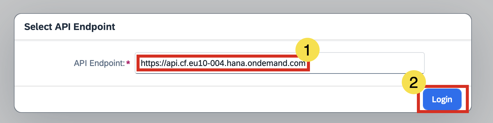  
3. Enter the origin key: **`tdct3ched1-platform`** and click **Sign in with alternative identity provider**.  
   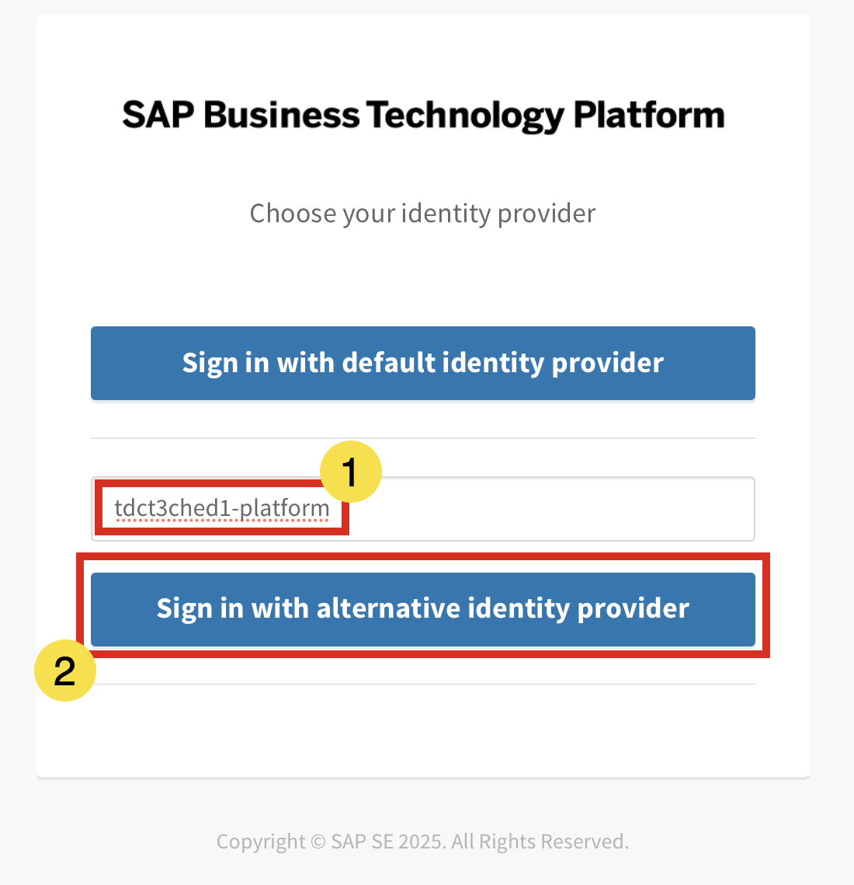  
4. Log in using the credentials provided by the session speakers.  
5. Verify the **Organization** and **Space** details as shown in the image, then click **Open**.  
   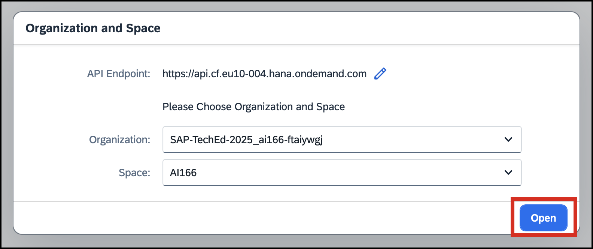  

## Exercise 2.2 Create a Mobile Services App

1. Click **Create New App**.  
 
   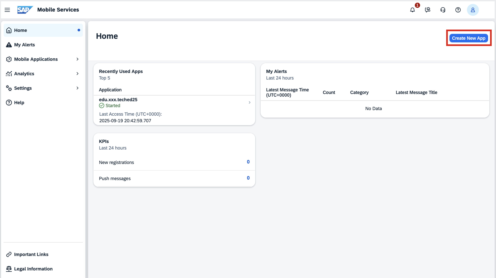  

2. In the **Type of Application** step of the wizard, select **MDK** and click **Next**.  
 
   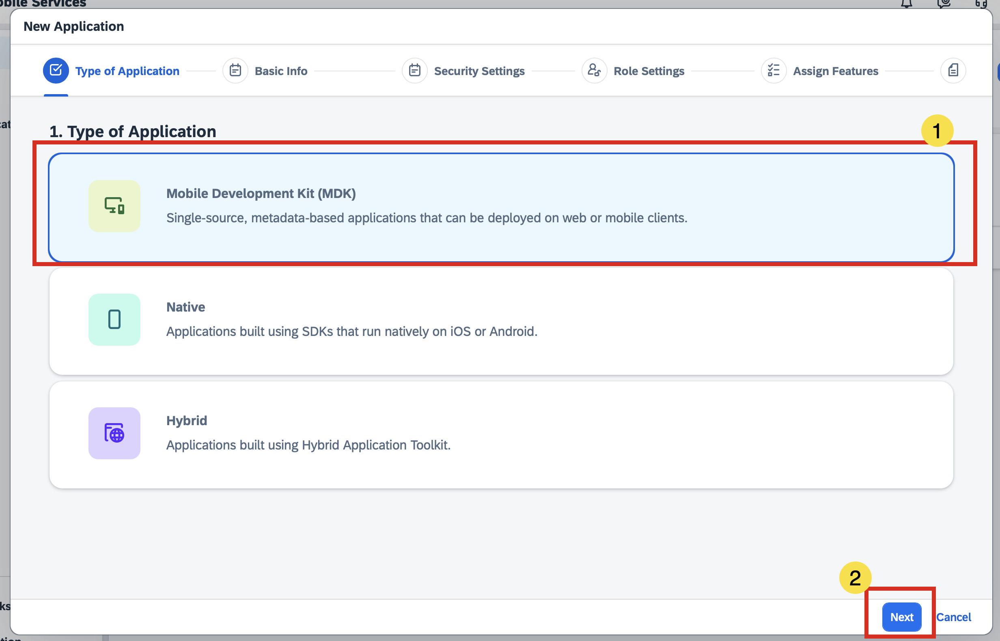  

3. In the **Basic Info** step, enter the following details and click **Next**:  

   | Key          | Value               | Comments |
   |--------------|---------------------|----------|
   | Service Plan | `build-code`        |          |
   | ID           | `edu.xxx.teched25`  | Replace `xxx` with your student number (last 3 digits of your login email). |
   | Name         | `XXX MDK App`       | Replace `xxx` with your student number (last 3 digits of your login email). |
   | Description  | *Any text you prefer* | Since the Mobile Services space is shared, follow the naming convention. You can customize the description to help identify your app. |

   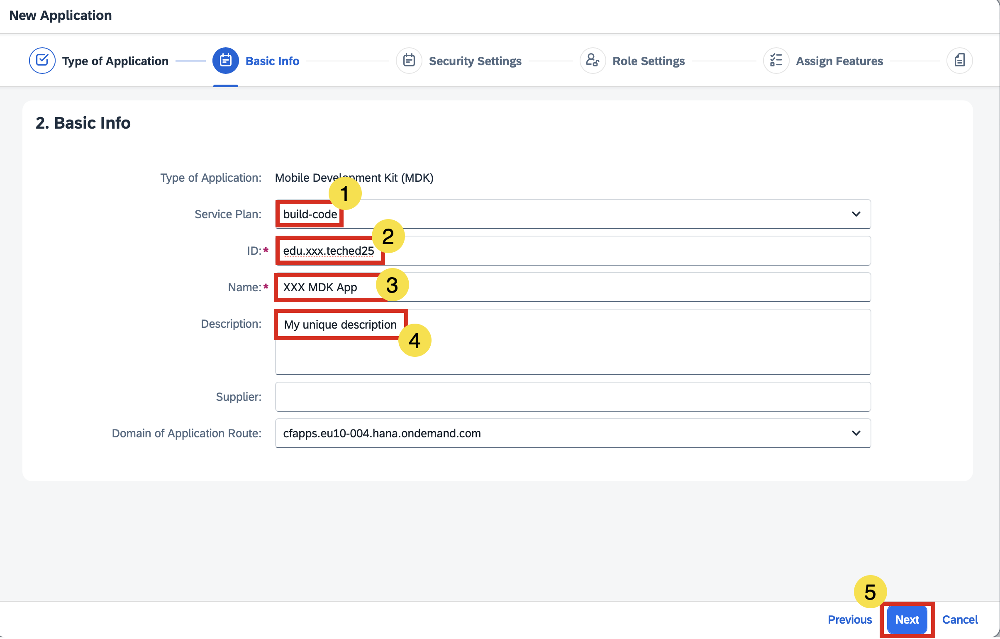  

4. In **Security Settings**, keep **XSUAA Settings** selected and click **Next**.  
   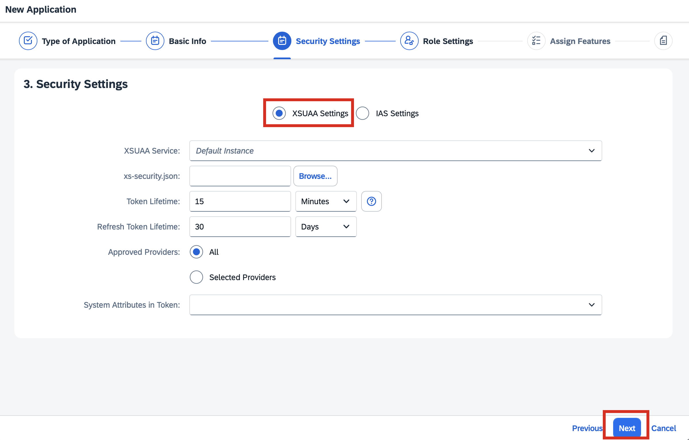  

5. Do not enable **Role Settings**, then click **Next**.  
   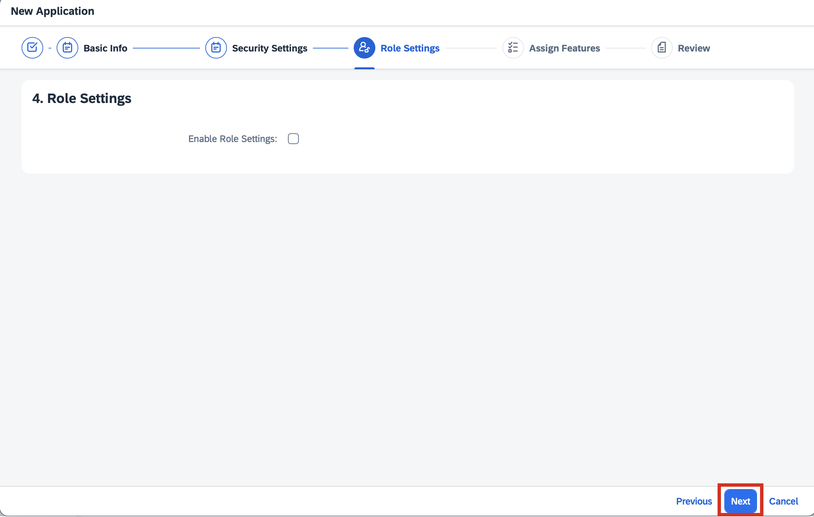  

6. In **Assigned Features**, ensure the following features are selected, then click **Next**.
   * App Catalog
   * App Update
   * Client Log Upload
   * Client Settings
   * Cloud Build
   * Connectivity
   * Offline Access
   * Push Notification
   * **Sample OData ESPM**
   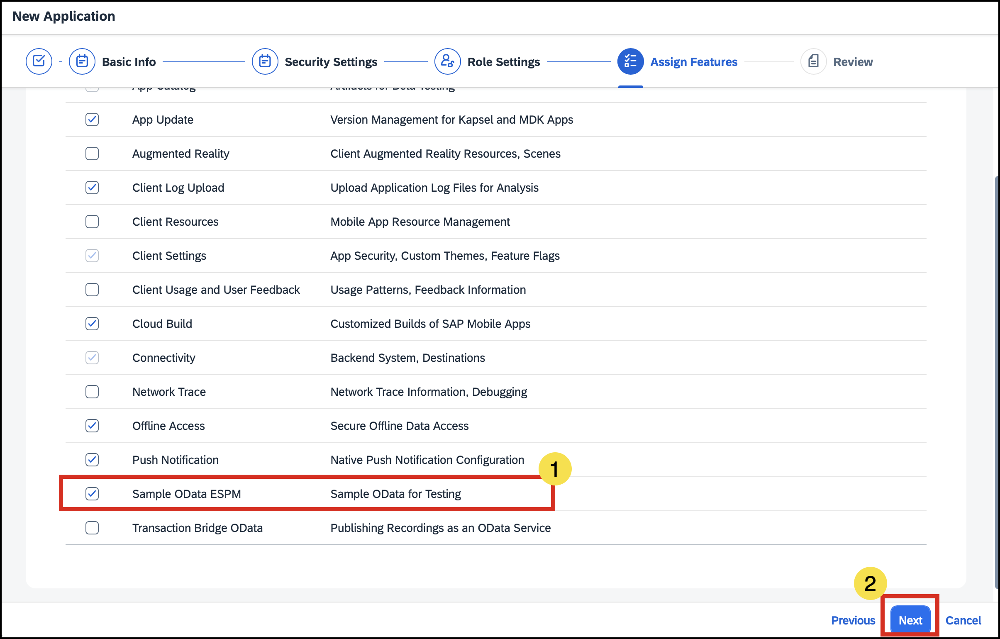  

7. Review your details and click **Finish**.  
   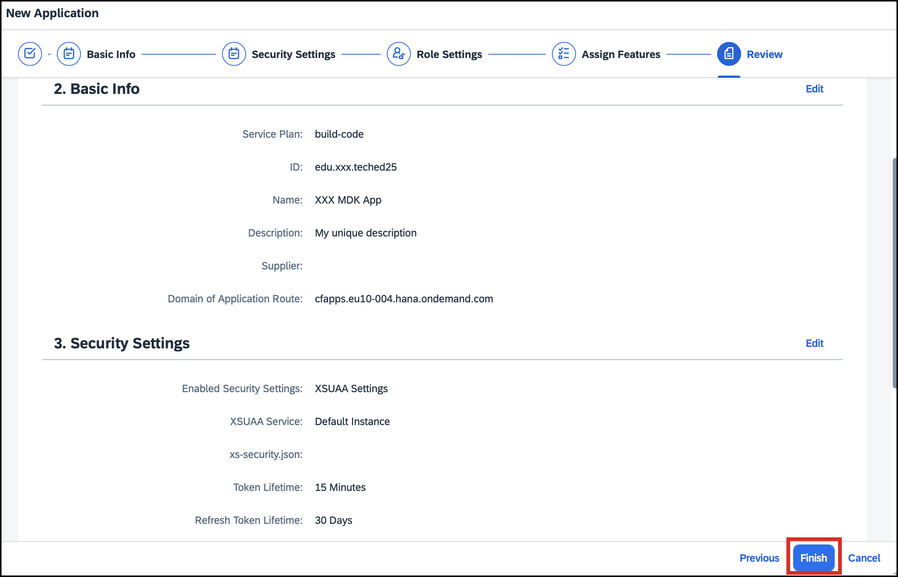

   > Click **OK**, in the warning dialog shown for not configuring role settings.
    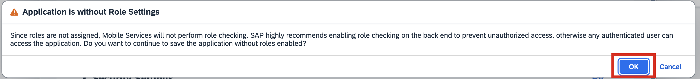

The app creation process may take up to *90 seconds*. In the meantime, you can either try the optional [Exercise 2.3](#exercise-23-j4c-queries-optional) or proceed directly to the [Summary](#summary).

   | In Process         | Completed               |
   |--------------|---------------------|
   | 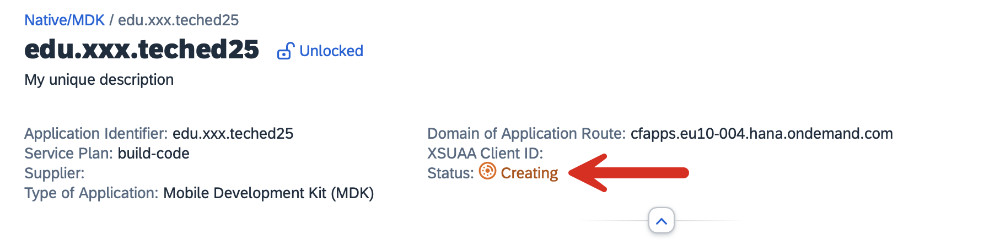 | 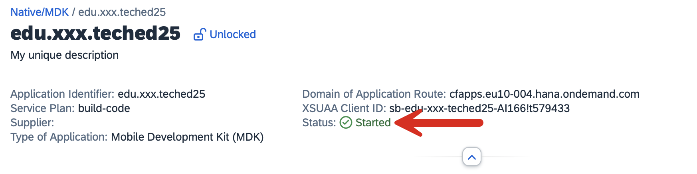 |

## Exercise 2.3 J4C Queries *(Optional)*

1. In a new tab, launch J4C: [https://ai166-ftaiywgj.eu10.sapdas.cloud.sap/joule](https://ai166-ftaiywgj.eu10.sapdas.cloud.sap/joule)  
2. Try the following example queries:  

   - **XSUAA vs IAS**  
     > What is the difference between XSUAA and IAS in Mobile Services?  

   - **Role Settings**  
     > What are role settings in SAP Mobile Services? How are they different from SAML attributes?  

## Summary

You have now explored the Mobile Services Cockpit and created a new Mobile Services app.

Continue to - [Exercise 3 - Create an MDK Project in SAP Build Lobby  ](../ex3/README.md)

