# Exercise 3 - Create an MDK Project in SAP Build Lobby  

In this exercise, you will access the SAP Build Lobby to create an MDK project and deploy the first version of your app.  

## Exercise 3.1 Access Lobby  

1. Open the SAP Build Lobby: [https://ai166-ftaiywgj.eu10.build.cloud.sap/lobby](https://ai166-ftaiywgj.eu10.build.cloud.sap/lobby)  
   > If prompted, select **`tdct3ched1.accounts.ondemand.com`** on the Identity Provider selection page.  
2. Log in using the credentials provided by the session speakers.  

## Exercise 3.2 Create Mobile Project  

1. In the SAP Build Lobby, click **Create** > **Create** to start the creation process.  
   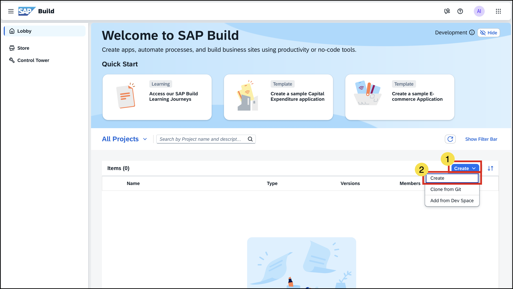  
2. Click the **Application** tile and choose **Next**.  
   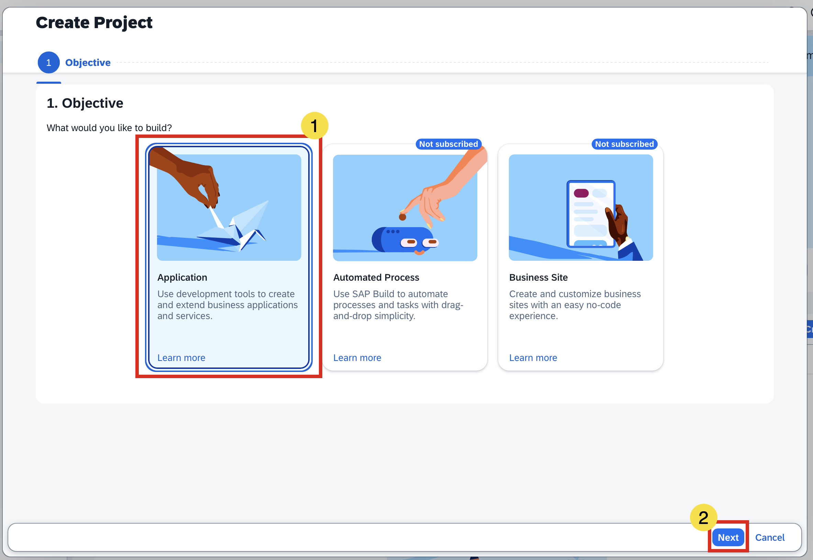  
3. Select the **Mobile** category and choose **Next**.  
   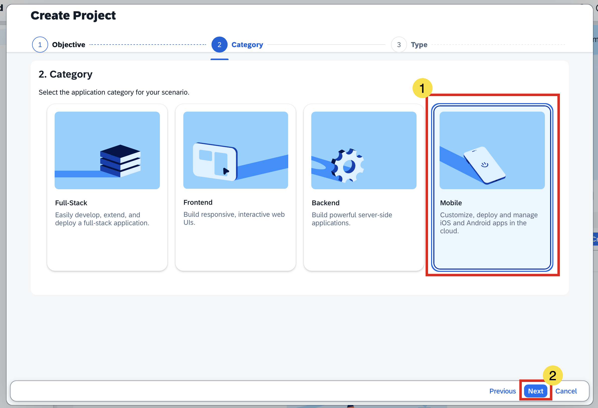  
4. Select **Mobile Application** to develop your mobile project in SAP Business Application Studio, then choose **Next**.  
   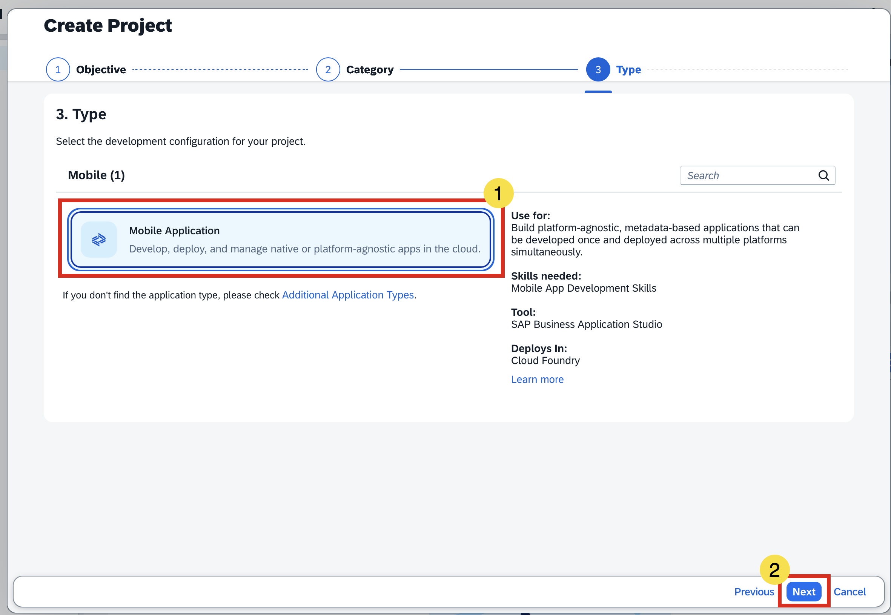  
5. Enter the following details and click **Review**:  

   | Key          | Value               | Comments |
   |--------------|---------------------|----------|
   | Name         | `XXXMDKApp`         | Replace `xxx` with your student number (last 3 digits of your login email). |
   | Description  | *Any text you prefer* | Since the Mobile Services space is shared, follow the naming convention. |
   | Dev Space    | `Mobile`            | SAP Build pre-selects the most suitable dev space. It will create a new one if needed, or you can reuse an existing Mobile Application dev space. See [Dev Space Manager](https://help.sap.com/docs/build_code/d0d8f5bfc3d640478854e6f4e7c7584a/ad40d52d0bea4d79baaf9626509caf33.html) for more details. |

   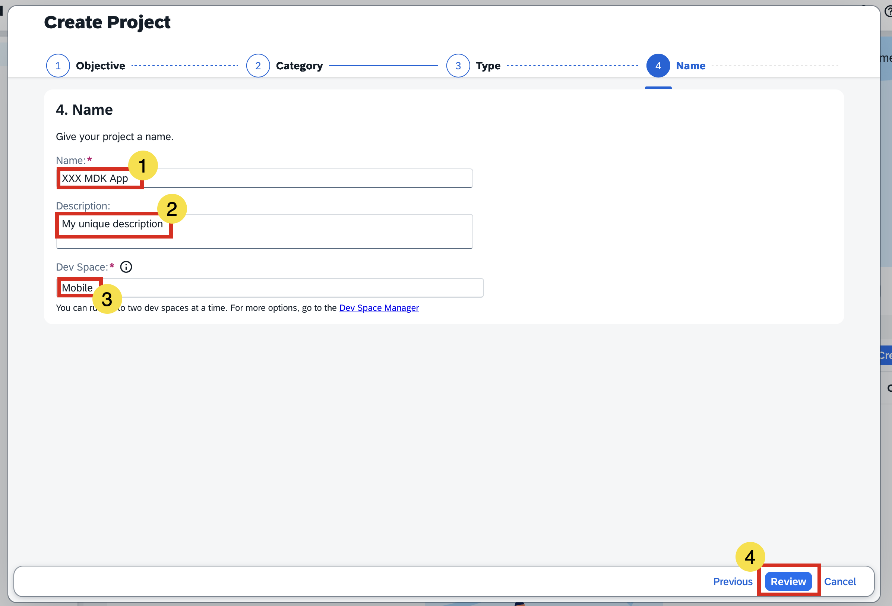  

6. Review the inputs under the **Summary** tab. If everything looks correct, click **Create**.  
   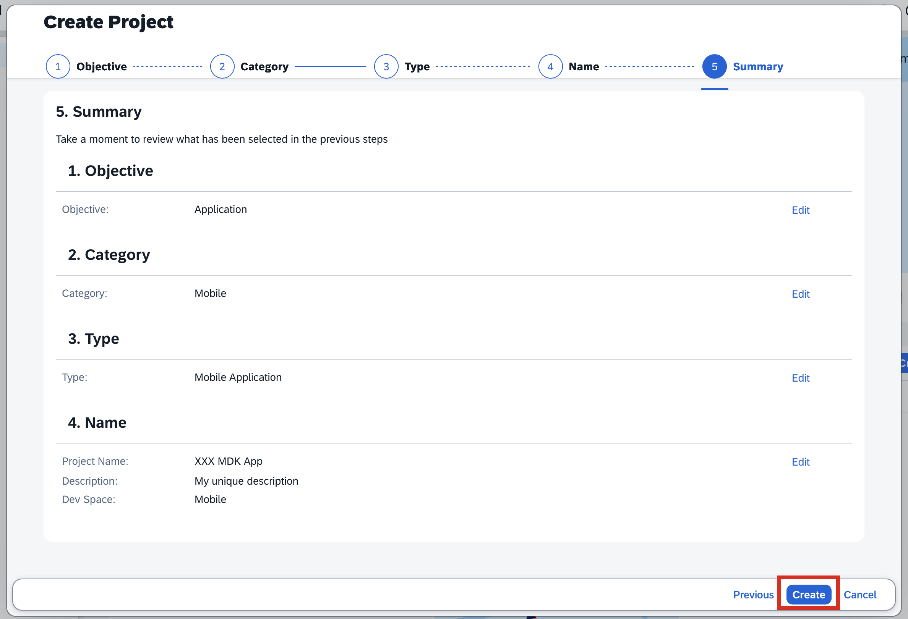  

   > Your project will appear in the Lobby project table. Creation may take up to *120 seconds*. In the meantime, you can try the optional [Exercise 3.6](#exercise-36-j4c-queries-optional).  

7. Once the project is created, click the project to open it.  
   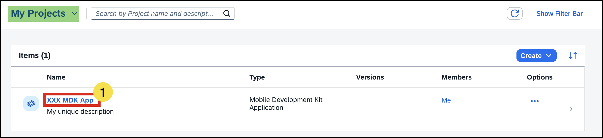

   > You can filter the SAP Build Lobby view to see only your projects.  

8. The project opens in SAP Business Application Studio.  

   > The first time you open BAS, you may see a consent dialog asking for permission to track usage. Review and provide your consent accordingly.  

## Exercise 3.3 Log in to Cloud Foundry (CF)  

1. Launch the **Command Palette** with **Shift+Ctrl+P**, type *Login*, and select **CF: Login to Cloud Foundry**.  
2. Select **SSO Passcode** as the authentication mode, then click **Open a new browser page to generate your SSO Passcode**.  
3. Sign in using the credentials provided during the session.  
   > If the username option does not appear, enter the origin key **`tdct3ched1-platform`** and click **Sign in with alternative identity provider**.  
4. Copy the temporary authentication code.  
5. Paste it in the **Enter your SSO Passcode** input field and click **Sign In**.  
6. Verify the **Organization** and **Space** details, then click **Apply**.  

   You will see toast notifications confirming that your CF login was successful.  

   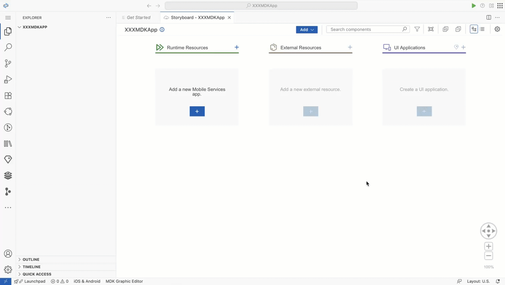  

## Exercise 3.4 Configure Runtime & External Resources Using Storyboard  

1. Click the **+** button in the **Runtime Resources** column to add a Mobile Services app to your project.  
     
2. Search for `XXX`, then select `edu.xxx.teched25` from the applications list in the **Mobile Application Services** editor.  
   > Replace `xxx` with your student number (last 3 digits of your login email).  
   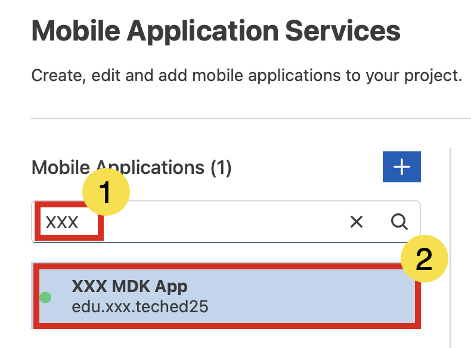  
3. Select `com.sap.edm.sampleservice.v4` from the destinations list and click **Add App to Project**.  
   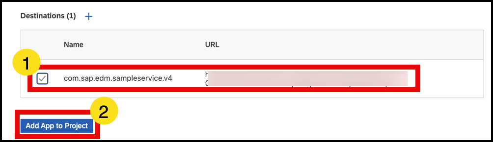  

The storyboard will now display the app under **Runtime Resources** and the destination under **External Resources**, connected by a dotted line.  

   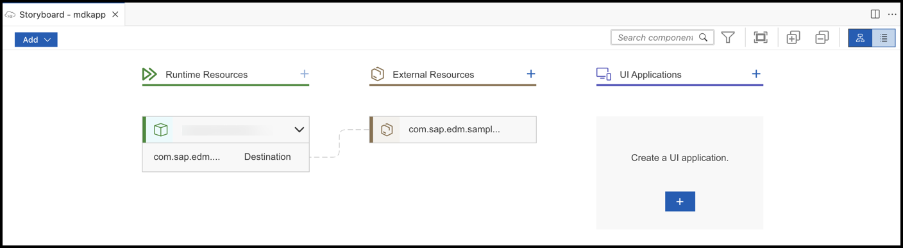  

## Exercise 3.5 Create Application UI  

1. Click the **+** button in the **UI Applications** column header to add a mobile UI.  
   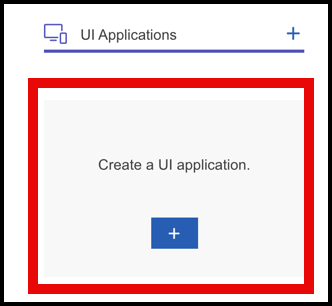  
2. In **Basic Information**, enter the following and click **Next**:  

   | Key              | Value  | Comments |
   |------------------|--------|----------|
   | MDK Template Type | `CRUD` | Leave all other options as default. |  

   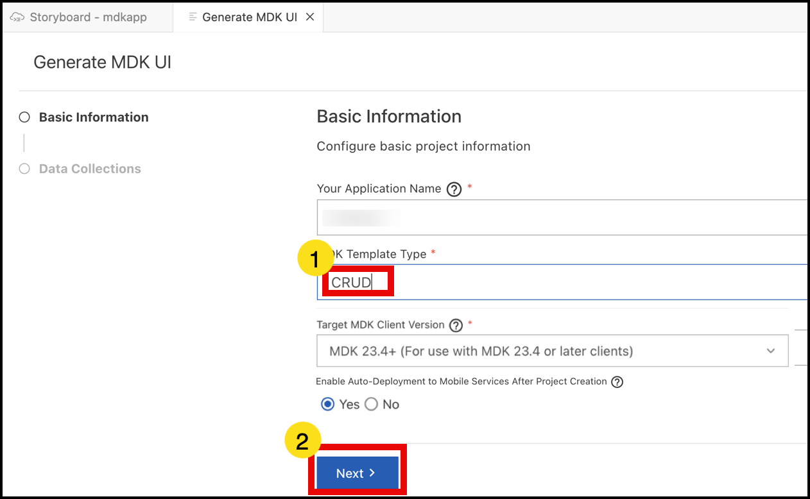  

3. In **Data Collections**, enter the following and click **Finish**:  

   | Key | Value |
   |-----|-------|
   | Path to service | Leave as is |
   | Service Type | `OData` |
   | Enable Offline | `Yes` |
   | Select all data collections | `Yes` |  

   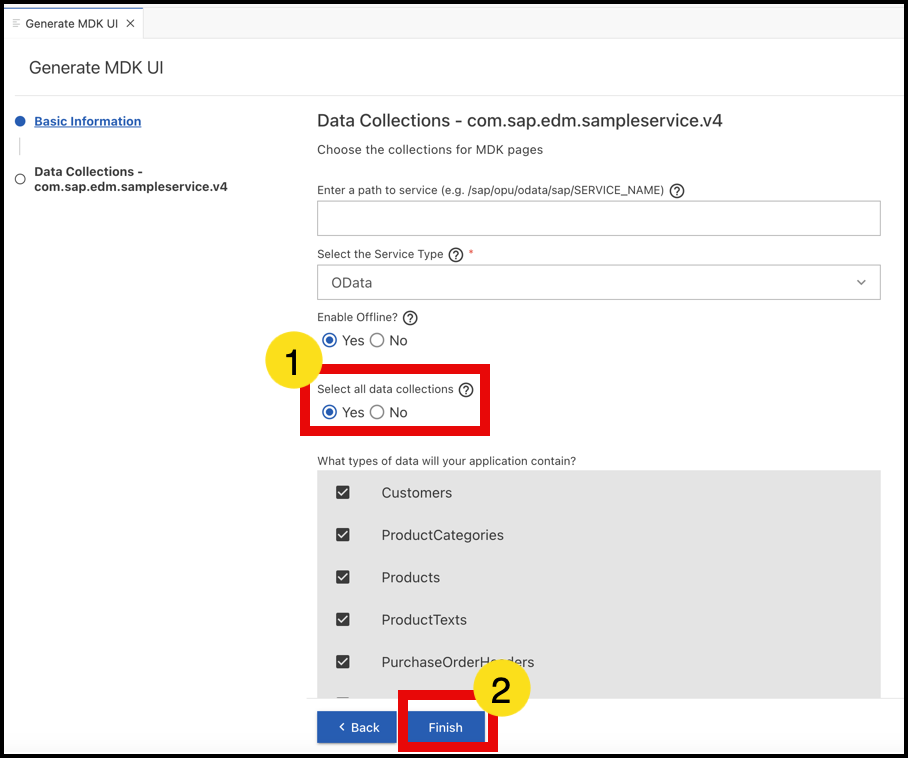  

   > With *Enable Offline* set to **Yes**, the generated app will support offline capabilities in the MDK Mobile client, allowing end-users to read/write data locally without network delays.  

4. After clicking **Finish**, the storyboard will update with the UI component.  
   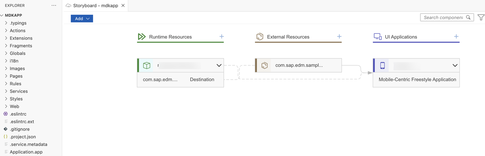  

The MDK project is generated in the Project Explorer and automatically deployed to Mobile Services. This may take up to *90 seconds*. In the meantime, you can either try the optional [Exercise 3.6](#exercise-36-j4c-queries-optional) or proceed directly to the [Summary](#summary).  

## Exercise 3.6 J4C Queries *(Optional)*  

1. Launch J4C: [https://ai166-ftaiywgj.eu10.sapdas.cloud.sap/joule](https://ai166-ftaiywgj.eu10.sapdas.cloud.sap/joule)  
2. Try the following example queries:  
   - **App in Cockpit vs Lobby**  
     > What is the difference between the MDK app I create in Mobile Services Cockpit and the one I create in SAP Build Lobby?  
   - **Runtime vs External Resource**  
     > What is the difference between Runtime Resource and External Resource for an MDK app?  

## Summary  

You have now used SAP Build Lobby to create an MDK project and deploy the first version. After deployment, a QR code will appear for onboarding the mobile app. Keep the Onboarding dialog box open for the next exercise.  

Continue to - [Exercise 4 - Using Your App on your Phone](../ex4/README.md)