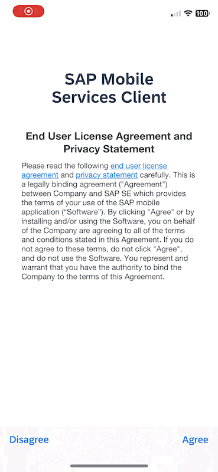
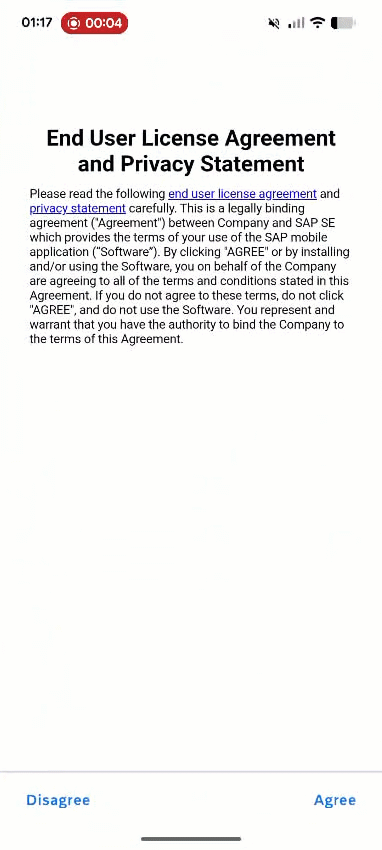
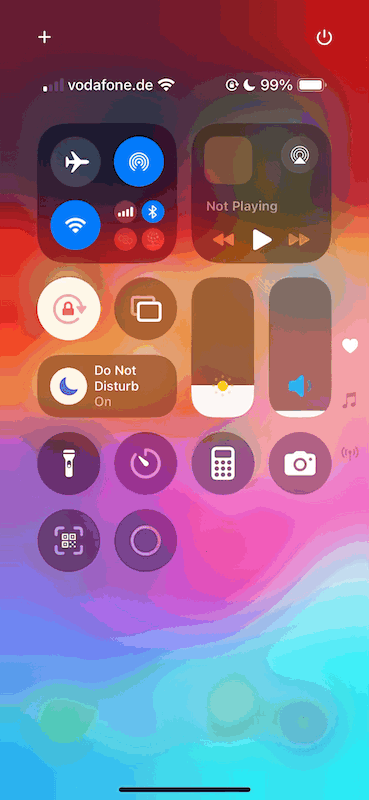

# Exercise 4 - Using Your App on your Phone

In this exercise, you will explore different features of the mobile app you built.

*Estimated Time: 🕓 10 minutes*

## Exercise 4.1 User Onboarding

1. Launch the app you installed in Exercise 1, **Mobile Svcs**, on your iOS/Android device.  

2. Tap **Agree** on the End User License Agreement and Privacy Statement.  

3. Tap **Use QR Code Scan** / **Scan** to start the device camera for scanning the onboarding QR code.  
   > Allow the app to access the camera on your device to scan the onboarding QR code.

4. Scan the QR code shown at the end of Exercise 3 in SAP Business Application Studio.  

5. Once the scan succeeds, tap **Continue**.  

6. Log in using the credentials provided by the session speakers.  
   > If prompted, select **`tdct3ched1.accounts.ondemand.com`** on the Identity Provider selection page.  

7. Create a passcode (minimum 8 characters) to unlock the app, and then tap **Next**.  

8. Confirm the passcode and tap **Done**.  

9. (Optional) Enable **Biometric Authentication** to unlock the app and decrypt data.  
   > You can also create a multi-user MDK app, i.e., one app shared among different workers based on shift timings.  
   > If this option is enabled, users do not get the option to use biometric authentication.

10. Tap **Now** to accept the deployed metadata definitions.  
    > If prompted, tap **Allow** to let the app send you notifications.  

| iOS | Android |
|-----|---------|
|  |  |

## Exercise 4.2 Scan to Search

1. Tap **Products** to open the products list.  

2. Using any online tool, create a QR code and a barcode for some text from the product list.  
   Example:  

   | QR Code | Barcode |
   |---------|---------|
   | `Camcorders` | `Ink Jet Printers` |

3. Tap the **magnifying glass** icon.  

4. Tap the **scanner icon** in the search bar.  

5. Scan the codes you generated.  
   Example:  

   | QR Code | Barcode |
   |---------|---------|
   |  |  |  

| iOS | Android |
|-----|---------|
|  |  |

## Exercise 4.3 Offline Actions

1. Turn on **Airplane mode** on your device. Please ensure that WiFi is also turned off.

2. Tap **Customers** to open the Customers list.  

3. Make a couple of modifications, for example:  
   - Edit the name of an existing customer to your name.  
   - Delete a customer record.  

4. Return to the main page, tap your **profile icon** to open the popover menu, and then select **Sync Changes**.  
   > Since you are offline, you will see an error.  

5. Turn off Airplane mode on your device, then sync changes again once the device is back online.

6. Verify your changes on the backend.  

   Use the URL below and replace **`xxx`** with the ID you used in your App ID.  

   ```url
   https://ai166-ftaiywgj-ai166-edu-xxx-teched25.cfapps.eu10-004.hana.ondemand.com/com.sap.edm.sampleservice.v4/Customers?auth=uaa
   ```
   
   > 📝 Note: If your app ID doesn’t follow the edu.xxx.teched25 format, adjust the URL accordingly by replacing each . with -

| iOS | Android |
|-----|---------|
|  |  |


## Summary

You've experienced how you can build a native application with cutting-edge features such as scanning and offline support on both platforms while maintaining a single code line.

## Navigation
| Previous| Next |
|---|---|
| [Exercise 3](../ex3/README.md) | [Exercise 5](../ex5/README.md) |