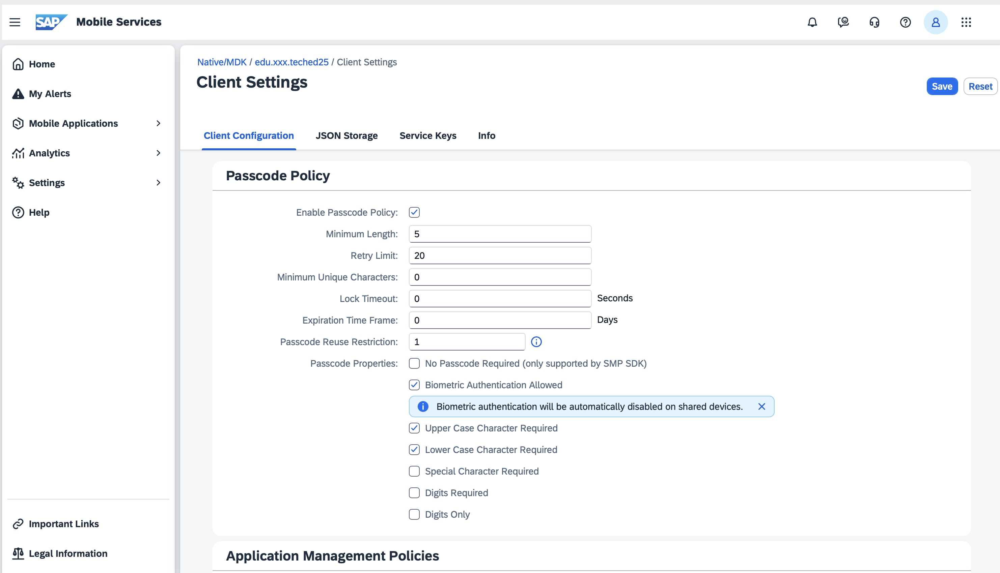
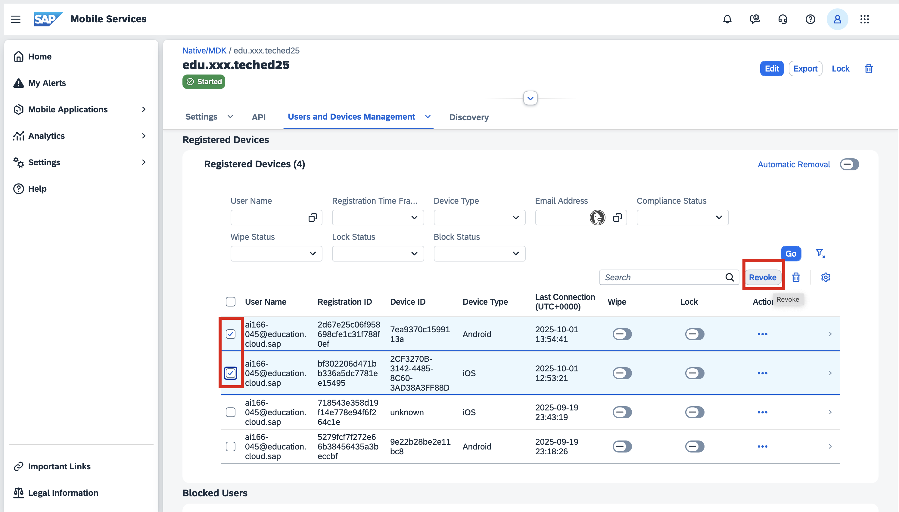

# Exercise 5 - J4C for Mobile Admins

In this exercise, you will use J4C to assist you with administration activities.

*Estimated Time: 🕓 20 minutes*

## Exercise 5.1 Modify Passcode Policy

1. Go back to J4C - https://ai166-ftaiywgj.eu10.sapdas.cloud.sap/joule  
   > You may have to reload the page and re-authenticate.

2. Start a New Conversation, and ask J4C to guide you to change the passcode policy by contextualizing your requirement.  
   Example query:  
   > **I am a Mobile Services Administrator. I have received complaints that 8 characters is too long. So after a security audit, I am allowed to reduce it to 5 characters, but the passcode should have at least one upper case, and one lower case character. How do I make this change in Mobile Services cockpit?**

3. Follow the steps mentioned by J4C.  

      > Since we have a monthly cloud shipment, J4C may not have the latest information. 
      > If you notice any discrepancy, please request assistance from the speaker. 
      > Alternatively, follow these steps to change the passcode policy:

      > | Actions | Visual Aid |
      > |-----------|--------|
      > | 1. Open the [Mobile Services Cockpit](https://mobile-service-cockpit-web.cfapps.eu10.hana.ondemand.com/logincfapi/index.html) and log in if required. 2. Open your app **edu.xxx.teched25**. 3. Open **Client Settings**. 4. In the Passcode Policy section of the Client Configuration tab:   &nbsp;&nbsp;&#9702; Change *Minimum Length* to **5**.  &nbsp;&nbsp;&#9702; Enable *Upper Case Character Required*   &nbsp;&nbsp;&#9702; Enable *Lower Case Character Required*. 5. Click **Save**. |    *💡 Tip: Click on the image to enlarge, then use your browser’s back button to return.* |
      > | 6. On your phone, kill and relaunch your app a couple of times to force the update.   7. On your device, you’ll be notified that the Passcode Policy has changed.   8. Confirm your current passcode   9. Set a new passcode following the updated policy. |     *📝 Note: Passcode screens don’t appear in the Android GIF because the OS automatically hides sensitive screens for security.*   *💡 Tip: Click a GIF to enlarge, then use your browser’s back button to return.* |

## Exercise 5.2 User and Device Management

1. Go back to J4C - https://ai166-ftaiywgj.eu10.sapdas.cloud.sap/joule  

2. Ask J4C to guide you on how to do remote user and device management.  
   Example queries:  
   > * **One of the end-users has reported that their device is lost. What options do I have to remotely handle this situation without impacting any other user?**
   > * **I would like to revoke access. Can you please guide me on how do I do it?**

3. Follow the steps mentioned by J4C.  

   > Since we have a monthly cloud shipment, J4C may not have the latest information. In case you notice any discrepancy, please request assistance from the speaker. Alternatively, use the following steps to revoke access:  
   
      > | Actions | Visual Aid |
      > |-----------|--------|
      > | 1. Open the [Mobile Services Cockpit](https://mobile-service-cockpit-web.cfapps.eu10.hana.ondemand.com/logincfapi/index.html) and log in if required. 2. Open your app **edu.xxx.teched25**. 3. Click **Users and Devices Management** tab.  4. Select one or more users and revoke access.  |    *💡 Tip: Click on the image to enlarge, then use your browser’s back button to return.* |
      > |  5. On your phone, kill and relaunch your app a couple of times to force the update, or tap **Sync Changes** in the app.   6. You will be forced to re-authenticate. Without completing it, you won’t be able to access the app data.|     *💡 Tip: Click a GIF to enlarge, then use your browser’s back button to return.* |

## Summary

You’ve now seen how J4C can help administrators take advantage of product features to meet evolving business requirements.

## Navigation
| Previous| Next |
|---|---|
| [Exercise 4](../ex4/README.md) | [Exercise 6](../ex6/README.md) |