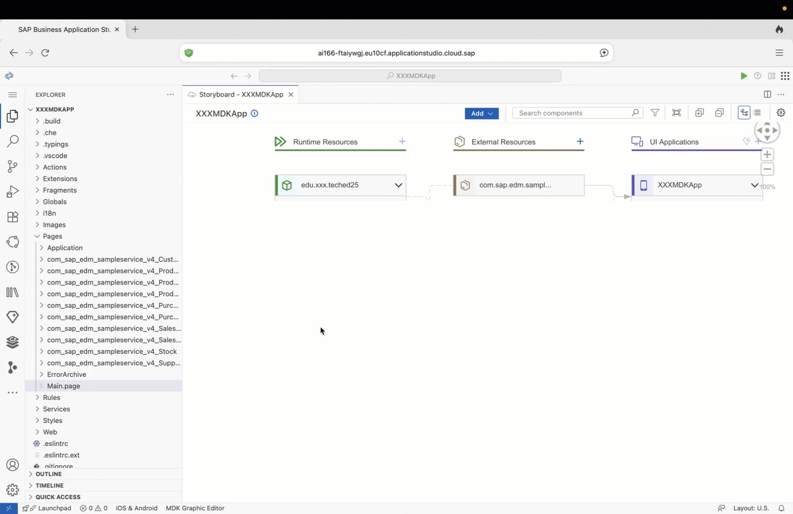
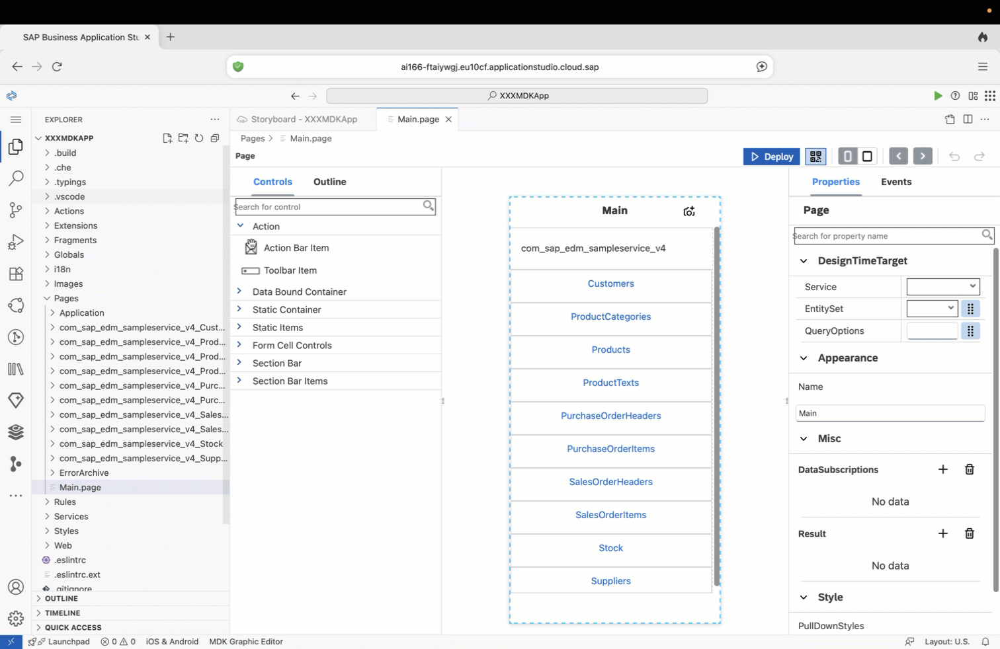
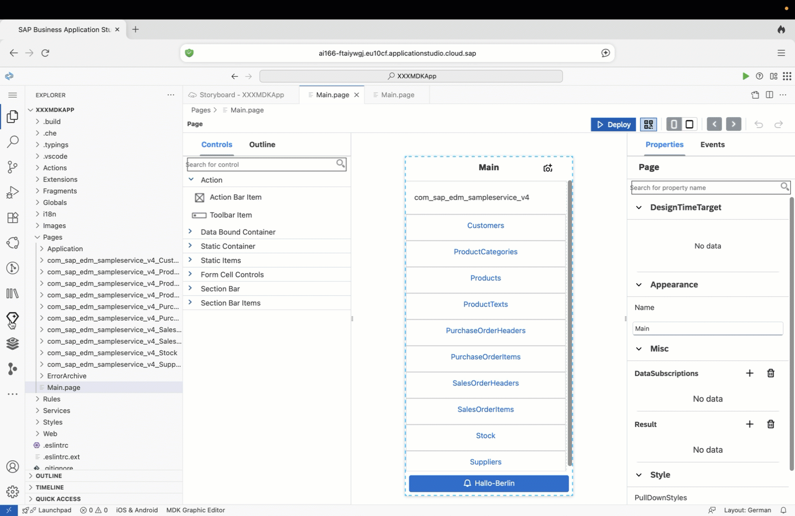
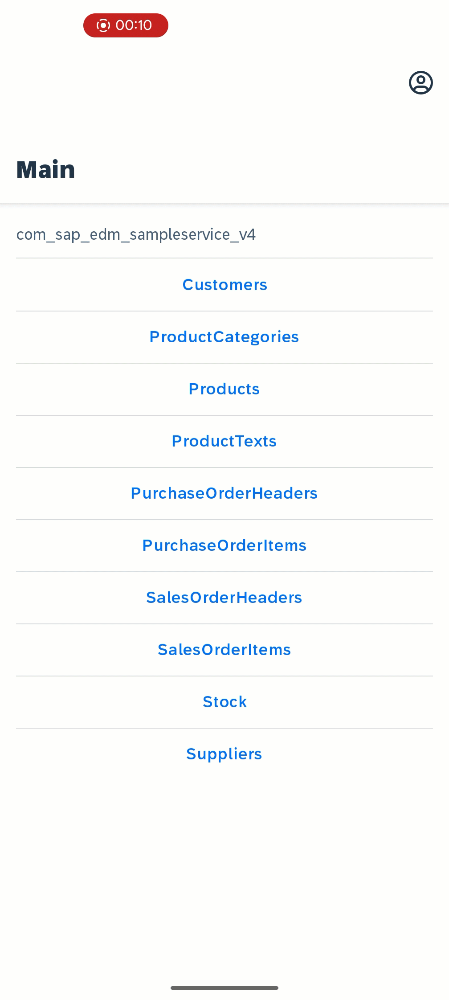

# Exercise 6 - App Development & Distribution

In this exercise, you will ship a new version of the app instantly after making changes using different techniques.

*Estimated Time: 🕓 20 minutes*

## Exercise 6.1 Navigate to Main.page

1. Open the SAP Build Lobby: [https://ai166-ftaiywgj.eu10.build.cloud.sap/lobby](https://ai166-ftaiywgj.eu10.build.cloud.sap/lobby)  
   > If prompted, select **`tdct3ched1.accounts.ondemand.com`** on the Identity Provider selection page.  
2. Log in using the credentials provided by the session speakers.  
3. Click on your project to open it.  
4. Open **Main.page**.  
   > *💡 Tip: The fastest way is to press **Ctrl+P** and type `Main.page`.*

|  |
|--------------|
|  |

## Exercise 6.2 Use Visual Editor to Make Changes

1. Search for **Toolbar Item** control.  
2. Drag and drop it to the bottom of **Main.page**.  
3. In the **Appearance** section of the Properties pane, add an Image and select the **link** icon.  
4. In the Object Browser, search for **bell** and double-click to ensure `"sap-icon://bell"` is added to the Expression input field, then click **OK**.  

| The changes should be visible immediately. |
|--------------|
|  |

## Exercise 6.3 Use Text Editor to Make Changes

1. Right-click on **Main.page** in the File Explorer and select **Open With → Text Editor**.  
2. Search for `ToolbarItem`.  
3. Update the properties as follows:  
   - **Title** → `"Hallo Berlin"`  
   - **ButtonType** → `"Primary"`  

   Example code snippet:  

   ```json
   "FioriToolbar": {
     "_Type": "Control.Type.FioriToolbar",
     "_Name": "FioriToolbar0",
     "Items": [
       {
         "_Type": "FioriToolbarItem.Type.Button",
         "_Name": "ToolbarItem0",
         "Visible": true,
         "Title": "Hallo Berlin",
         "Image": "sap-icon://bell",
         "Enabled": true,
         "ButtonType": "Primary",
         "Semantic": "Tint",
         "ImagePosition": "Leading"
       }
     ]
   }

| You can verify your changes by reopening Main.page in the Page Editor. |
|--------------|
|  |

## Exercise 6.4 Use Joule Editor to Make Changes

1. Click the **Joule** icon in the side navigation bar.
   > *💡 Tip: If you’re not sure which one is the Joule icon, please see the GIF at the end of this section.*
2. Select `/mdk-gen-action` and the default sample service.  
3. Ask Joule to create a toast message:  
   
   Example query:  
   > hey Joule can you please help me create an action to show a toast message with the text Hallo Berlin!!!

   ```url
   /mdk-gen-action #Services/com_sap_edm_sampleservice_v4.service hey Joule can you please help me create an action to show a toast message with the text Hallo Berlin!!!
   ```

4. Click **Accept** to generate the action.  

| Joule will automatically create the action file for your project. |
|--------------|
|  |

## Exercise 6.5 Configure Action and Deploy

1. Open **Main.page** in the Page Editor.  
2. Select the **Hallo-Berlin** toolbar item.  
3. Navigate to the **Events** tab in the right-hand sidebar.  
4. Tap the **Bind Target** icon for the **OnPress** event.
   > *💡 Tip: If you’re not sure which one is the Bind Target icon, please see the GIF at the end of this section.*
5. Select *Object Browser* option in subsequent menu.
6. Search for the file generated by Joule (e.g., `HalloBerlinToast.action`).  
7. Double-click the filename to bind the action (e.g., `/XXXMDKApp/Actions/HalloBerlinToast.action`) .
8. Click **OK**.  
9. Click **Deploy**.  

| Joule will automatically create the action file for your project. |
|--------------|
|  |

## Exercise 6.6 Test
  
1. On your mobile device, launch the client app.  
   > If you revoked user access in a previous exercise, you may need to re-authenticate with the credentials provided by the session speakers.  
2. Tap **Now** to download the latest version.  
   > If not prompted automatically, select **Check for Updates** from the pop-over menu.  
3.  Once the update is complete, tap the **Hallo-Berlin** button to verify the toast message is displayed.

| iOS | Android |
|-----|---------|
|  |  |

---

## Summary

You’ve now seen how easy it is to update your MDK app using visual, text-based, or AI-assisted modes, and distribute the new version to end users instantly.


## Navigation
| Previous| Next |
|---|---|
| [Exercise 5](../ex5/README.md) | [Conclusion](../../assets/README.md) |